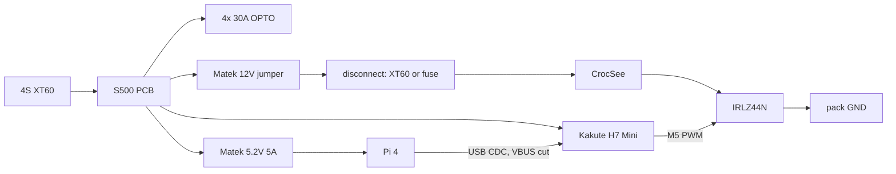

# weed-spray wiring

From `bom/current.csv` (2026-08-30). Pump PWM is Kakute M5 = Peripheral via Actuator Set 1 (`px4/actuators.md`). Do not assign Parachute (failsafe would turn the MOSFET on). Not a live aircraft. Do not power this from the cloud.

Household vinegar/salt only. No herbicide hardware.

## Connector map (every BOM line)

| BOM line | Connector | Notes |
|---|---|---|
| Readytosky S500 + CF gear | mechanical + PCB power | Center plate is the PDB. Belly clearance for lidar + nozzle. |
| HAWK 2212 920 KV | 3.5 mm bullets (power) | 2–4S only. No 6S. |
| Readytosky 30 A OPTO | 4S power to PDB; **PWM** signal from Kakute M1–M4 | No BEC. PWM, not DShot. |
| SoloGood 1045 | mechanical | Confirm adapter rings vs 2212 shaft. |
| OVONIC 4S 2200 XT60 | **power** XT60 | 16.8 V charged. Undersize pack. |
| Aorika B6AC | bench XT60 + JST-XH | Not on the aircraft. Laptop is not the charger. |
| Kakute H7 Mini | **power** B+ (2–6S); PWM; UART; I2C; onboard 5 V / 2 A BEC | Flash PX4 bootloader from Betaflight. Solder pads, not Pixhawk GH. |
| Holybro M10 GPS | **UART4** + **I2C** + 5 V | 10-pin GH does not plug into Kakute. Solder. |
| Holybro PMW3901 | **UART2** + 5 V | `SENS_TFLOW_CFG`. Notch aft. |
| Benewake TFmini-S | **UART1** + 5 V | `SENS_TFMINI_CFG`. I2C plan withdrawn. |
| RadioMaster Pocket ELRS | **2.4 GHz radio** (handheld) | Not on the airframe. RC in hand when motors can spin. 2×18650 not in BOM. |
| RadioMaster RP1 V2 | **UART6 CRSF** + 5 V | U.FL T-antenna. |
| Raspberry Pi 4 2GB | **power** 5.2 V; **USB CDC** MAVLink; **WiFi** RTSP; CSI | Do not use Kakute 5 V. USB-A host to Kakute USB, VBUS cut. Spec wanted Pi Zero 2W (US OOS). |
| SanDisk 32 GB | microSD (Pi) | |
| Arducam IMX708 Cam3 | **CSI** FFC | No USB cam. |
| Matek 12S Pro BEC (unit 1) | **power** 4S in → 5.2 V / 5 A out | Jumper **5.2 V**. Pi only. |
| Matek 12S Pro BEC (unit 2) | **power** 4S in → 12 V / 5 A out | Jumper **12 V**. Pump only. GetFPV $24.99. VIN≥14 V for stiff 12 V ([Matek](https://www.mateksys.com/?portfolio=bec12s-pro)). |
| CrocSee 12 V pump | **power** 12 V BEC through MOSFET | 9–14 V. **Do not feed raw 4S.** Maiden: open this lead. |
| IRLZ44N | **PWM** gate from Kakute M5 | Low-side. 3.3 V OK. |
| 0.4 mm brass mister | fluid | One nozzle. Aft of lidar. |
| ~250 ml HDPE tank | fluid | Vent cap. Vinegar-safe. |
| XT60 5-pair | **power** | 16 AWG silicone. |
| M3 nylon standoffs | mechanical | Pi, pump, tank. |

Shipping and tax lines have no connector.

## Rails

| Rail | Source | Feeds |
|---|---|---|
| 4S (14.8 V nom, 16.8 V charged) | pack XT60 → S500 PCB | ESCs, Kakute B+, Matek VIN, **future** 12 V buck VIN |
| 5 V / 2 A | Kakute BEC | FC, GPS, flow, lidar, RP1. **Not the Pi.** |
| 5.2 V / 5 A | Matek, jumper 5.2 V | Pi 4 + CSI cam |
| 12 V / 5 A | second Matek, jumper **12 V** | pump + only. Dropout: VIN≥14 V |
| 3.3 V PWM | Kakute M5 | MOSFET gate |

OPTO ESCs have no BEC. Kakute must see pack on B+.



## Pump path (must be leave-able disconnected)

```
4S PDB -- Matek 12V BEC -- fused XT60 or bullet  -- pump+
pump- -- IRLZ44N drain
IRLZ44N source -- pack GND
IRLZ44N gate -- 220 Ω -- Kakute M5
IRLZ44N gate -- 10 kΩ -- pack GND   (default OFF)
1N4007 flyback: cathode to 12V, anode to drain
```

Maiden and any first hover: **open that fused XT60 / bullet**. Not “software off.” Do not connect 16.8 V to the 9–14 V pump. Flyback diode is not a BOM line; add a 1N4007. 4S empty ~13.2 V may sag under the Matek 2 V dropout; pump min is 9 V so sag is OK, raw 16.8 V is not.

Pump ≤ 350 mA @ 12 V (~0.3 A on the pack). Negligible vs 10–20 A class hover. The brown-out risk is the Pi on the wrong 5 V rail, not the pump.

## Kakute pads

| Pad | Use |
|---|---|
| B+, GND | 4S from PDB |
| USB device | Pi USB host, CDC MAVLink. **VBUS / 5 V cut.** D+, D−, GND only. Plug type: **unknown** (check Holybro photo/silkscreen). Owner: operator. |
| M1–M4 | ESC PWM |
| M5 | pump MOSFET gate. Disarmed / failsafe / USB-loss = low |
| T4 / R4 | M10 GPS UART |
| SDA / SCL | M10 IST8310 compass **only**. Not TFmini. |
| T2 / R2 | PMW3901 |
| T6 / R6 | RP1 CRSF |
| T1 / R1 | TFmini-S UART (`SENS_TFMINI_CFG`) |
| UART3 | debug, leave it |
| UART7 | DShot RX-only, unused |

## Mounting

Belly sees turf. Nozzle **aft of** TFmini-S so spray does not coat the lens. PMW3901 near CG, notch aft, out of the prop disk. Pi WiFi antenna away from the RP1 T-antenna (both 2.4 GHz). GPS on a mast. Tank zip-tied, CG on the X.

## Flying USB cable (signed)

Pi USB-A host → short pigtail → Kakute USB device (CDC). Plug type: **unknown**. PX4 CDC `/dev/ttyACM0` on the Pi ([parameters.md](../px4/parameters.md)). Not TELEM1. [Kakute H7 Mini](https://docs.px4.io/main/en/flight_controller/kakuteh7mini).

| Wire | Do |
|---|---|
| D+, D− | connect |
| GND | connect. Common with pack / Matek / Kakute / Pi. |
| VBUS / 5 V (usually red) | **CUT.** Meter it open before first pack. Pi VBUS must not fight Kakute B+ / onboard BEC. |
| Shield | drain at one end if it exists |

Strain-relieve the pigtail to the S500 plate. No lever on the 20×20 USB plug.

USB unplug = companion MAVLink loss. MOSFET gate pulldown keeps the pump off if PWM goes high-Z. **Pump-off on CDC drop is still a PX4 failsafe** (`px4/actuators.md`). Bench: yank the USB, M5 must go low, pump lead still open.

In flight, QGC is Pi WiFi, not a laptop USB cable.

**Signed:** this is the companion path. Keep Kakute. Do not SKU 6C Mini for UARTs.

## Conflicts

- **12 V rail is the second Matek**, jumper 12 V. Label both BECs. Mix-up 5.2 vs 12 V will kill the Pi or the pump.
- **Pi 4 is hungry.** Kakute 5 V / 2 A will brown out if the Pi is on it. Matek 5.2 V only.
- **Motors 2–4S.** Pack is 4S. No 6S.
- Flying USB on 20×20 will rip out if it is not tied down.
